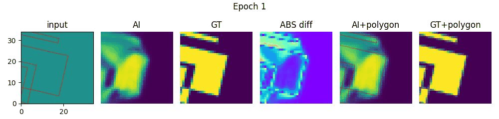

# U-net Based Poly to Matrix
   
   
   
Test code about make fill polygon method (like opencv fillpoly) by using deep-learning tools.   
Purpose of this test is directly fill matrix from sub-pixel level polygon data without Signed Distance Function (SDF) or Up-Down scaled matrix.   
   
Model is based on U-net structure. Model needs three input which matrix, polygon, polygon padding.   
Input polygon shape is $N \times 6$ ($x$, $y$, $+\Delta x$, $+\Delta y$, $-\Delta x$, $-\Delta y$).   
|---|poly1-v1|poly1-v2|poly1-v3|poly2-v1|poly2-v2|poly2-v3|poly2-v4|poly2-v5|
|---|---|---|---|---|---|---|---|---|
|$x$|$x_{p1-1}$|$x_{p1-2}$|$x_{p1-3}$|$x_{p2-1}$|$x_{p2-2}$|$x_{p2-3}$|$x_{p2-4}$|$x_{p2-5}$|
|$y$|$y_{p1-1}$|$y_{p1-2}$|$y_{p1-3}$|$y_{p2-1}$|$y_{p2-2}$|$y_{p2-3}$|$y_{p2-4}$|$y_{p2-5}$|
|$+\Delta x$|$x_{p1-2} - x_{p1-1}$|$x_{p1-3} - x_{p1-2}$|$x_{p1-1} - x_{p1-3}$|$x_{p2-2} - x_{p2-1}$|$x_{p2-3} - x_{p2-2}$|$x_{p2-4} - x_{p2-3}$|$x_{p2-5} - x_{p2-4}$|$x_{p2-1} - x_{p2-5}$|
|$+\Delta y$|$y_{p1-2} - y_{p1-1}$|$y_{p1-3} - y_{p1-2}$|$y_{p1-1} - y_{p1-3}$|$y_{p2-2} - y_{p2-1}$|$y_{p2-3} - y_{p2-2}$|$y_{p2-4} - y_{p2-3}$|$y_{p2-5} - y_{p2-4}$|$y_{p2-1} - y_{p2-5}$|
|$-\Delta x$|$x_{p1-1} - x_{p1-2}$|$x_{p1-2} - x_{p1-3}$|$x_{p1-3} - x_{p1-1}$|$x_{p2-1} - x_{p2-2}$|$x_{p2-2} - x_{p2-3}$|$x_{p2-3} - x_{p2-4}$|$x_{p2-4} - x_{p2-5}$|$x_{p2-5} - x_{p2-1}$|
|$-\Delta y$|$y_{p1-1} - y_{p1-2}$|$y_{p1-2} - y_{p1-3}$|$y_{p1-3} - y_{p1-1}$|$y_{p2-1} - y_{p2-2}$|$y_{p2-2} - y_{p2-3}$|$y_{p2-3} - y_{p2-4}$|$y_{p2-4} - y_{p2-5}$|$y_{p2-5} - y_{p2-1}$|
   
$N$ is total vertices num ($N$ is 8 when polygon 1 vertices num 3 and polygon 2 vertices num 5). Polygon seperating condition gained from $+\Delta$ and $-\Delta$ datas (See between poly1-v3 and poly2-v1).   
   
Embedded polygon datas have cross-attention with matrix encoding features.   
   